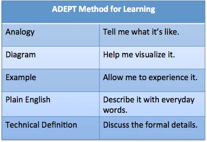

# cs197

Date de création: 30 juillet 2025 22:24
Étiquettes: Ai, Courses, Machine Learning, ai-research

Suporte:

[https://docs.google.com/document/d/1z5ELxpTw_U01jUB6-D6ILqHRPg6SSiLE7VFQryH3LPU/edit?tab=t.0](https://docs.google.com/document/d/1z5ELxpTw_U01jUB6-D6ILqHRPg6SSiLE7VFQryH3LPU/edit?tab=t.0)

https://betterexplained.com/articles/adept-machine-learning-course/

https://betterexplained.com/articles/developing-your-intuition-for-math/



**A simple study plan: Go through the material. Did it click? Write down what helped, otherwise look for a better explanation.**

## Questions

- Create an tensor from the nested list [[5,3], [0,9]]
    
    **data = [[5, 3], [0, 9]]**
    
    **x_data = torch.tensor(data)**
    
- Create a tensor ‘t’ of shape (5, 4) with random numbers from a uniform distribution on the interval [0, 1)
    
    **t = torch.rand((5,4))**
    
- Find out which device the tensor ‘t’ is on and what its datatype is.
    
    **print(t.device) *# cpu***
    
    **print(t.dtype) *# float32***
    
- Create two random tensors of shape (4,4) and (4,4) called ‘u’ and ‘v’ respectively. Join them to make a tensor of shape (8, 4).
    
    ```python
    u = torch.randn((4,4))
    v = torch.randn((4,4))
    print(torch.concat((u,v), dim=0).shape) # torch.Size([8, 4])
    ```
    
- Join u and v to create a tensor of shape (2, 4, 4).
    
    ```python
    w = torch.stack((u,v), dim=2)
    print(w.shape) # torch.Size([4, 4, 2])
    ```
    
- Join u and v to make a tensor, called w of shape (4, 4, 2).
    
    ```python
    w = torch.stack((u,v), dim=2)
    print(w.shape) # torch.Size([4, 4, 2])
    ```
    
- Index w at 3, 3, 0. Call that element ‘e’.
    
    ```python
    e = w[3,3,0]
    ```
    
- Which of u or v would you find w in? Verify.
    
    ```python
    w[3,3,0] == u[3,3] # True
    ```
    
- Create a tensor ‘a’ of ones with shape (4, 3). Perform element wise multiplication of ‘a’ with itself.
- Add an extra dimension to ‘a’ (a new 0th dimension)
- Perform a matrix multiplication of a with a transposed.
- What would a.mul(a) result in?
- What would a.matmul(a.T) result in?
- What would a.mul(a.T) result in?
- Guess what the following will print. Verify
- What will the following print?
- What’s the difference between `.stack()` and `.cat()`
    
    **stack** join by creating a new dimension
    
    ```python
    import torch
    
    u = torch.rand((4, 4))
    v = torch.rand((4, 4))
    w = torch.rand(4, 4)
    
    print(u.shape, v.shape, w.shape) # torch.Size([3, 4, 4])
    ```
    
    cat uses the existing one
    
    ```python
    cat_tensors = torch.cat([u, v, w])
    cat_tensors.shape # torch.Size([12, 4])
    ```
    

## Aula 2

Vocabulário:

- debugging: corrgir código
- linting: formatar código
- versioning: manter cópia segura do código

Aha: no vscode podemos usar atalhos para acessar arquivos, tutoriais. a tecla que permite acesso a caixa onde procuramos os arquivo é o `ctrl+shift+p`.

outros comandos úteis:

- ctrl + b faz a aba onde ficam os .py retrair.
- ctrl + k e depos z fica no modo foco, em tela cheia.
- ctrl + shift + ‘ abre o terminal
- ctrl+shift+m vai te levar ao erro em seu arquivo
    - f8 para navegar entre os erros.
- ctrl + alt + up cursor seleciona várias coisas ao mesmo tempo
- ctrl+k ctrl+f selecionar código inteiro
    - shift+alt+f formar código
- ctrl + l selecionar linha atual

Aha: se eu for trabalhar com base de dados grande, é bom voltar a estudar estes comandos.

Gotcha: It’s totally normal to take multiple passes through these tutorials; they are dense, and you are unlikely to use all of the features you encounter regularly

As linhas abaixo:

```bash
mkdir hello => criar basta
cd hello => ir até basta
code . => fazer ela aparecer no vscode
```

Um ambiente virtual tem como objetivo garantir que qualquer coisa isolada, existe apenas nele.

Recursos:

- https://code.visualstudio.com/docs/python/python-tutorial

Coisas importantes e para se aprofundar:

- criar venv
- debugar código no vscode
- gerenciar pacotes no venv
    - `pip freeze`
- uv
- conda

Use `ctrl + space` para obter sugestões, para o teu código.

Day 1- Python Environment Setup, Industry Project Configuration And Package Management (Tutorial para configurar Anaconda no Vscode)

https://www.youtube.com/watch?v=4s7mOZ07tBc

**CondaNavigator** é importante para você saber, quanto env você tem em seu computador, para gerenciar eles.

Aha: a questão de usar env é que, geralmente tu estará trabalhando com vários projetos ao mesmo tempo.

Há duas formas de criar um env com conda:

- `conda create -p venv python==3.12`
- `conda create -n venv python==3.12`

-p: o ambiente criado será com o que já existe na pasta do projeto.

-n: cria ambiente da pasta do conda

após criar um `venv`, você ativa ele, com `conda activate venv/`. Isto é feito para que os pacotes se limitem a esse venv.

## Aula 4

> **i’ve found that building is the most effective way of learning when it comes to AI/ML engineering.**
> 

coisas que eu preciso aprender:

- **dataset loading,**
- **tokenization,**
- **and fine-tuning.**

coisas que devo aprender II

- **Load up and process a natural language processing dataset using the datasets library.**
- **Tokenize a text sequence, and understand the steps used in tokenization.**
- **Construct a dataset and training step for causal language modeling**

```python
%%capture
pip install transformers datasets
```

essa linha instala as duas bibliotecas que precisamos:

- hf tranformers
- datasets

```python
from datasets import load_dataset
dataset = load_dataset("nunorc/squad_v1_pt")
dataset
```

esse é o padrão para ler qualquer dataset do hf, fiz uma busca mas não achei dataset br de Q&A.

poderia testar em outro dataset, essa task, para criar uma variação.

squad-1 em pt-br: https://huggingface.co/datasets/nunorc/squad_v1_pt

```python
def add_end_of_text(example):
    example['question'] =  example['question'] + '<|endoftext|>'
    return example

dataset = dataset.remove_columns(['id', 'title', 'context', 'answers'])
dataset = dataset.map(add_end_of_text)
```

esse `'<|endoftext|>'` serve para o caso em que juntamos duas sentenças em um único bloco. e.g `gosto de comer <endoftext> eu adorei.`

```python
from transformers import AutoTokenizer
model_checkpoint = "tubyneto/bertimbau"

tokenizer = AutoTokenizer.from_pretrained(model_checkpoint, use_fast=True)
```

este trecho carrega o modelo que irá tokenizar as frases.

```python
sequence = ("Está tokenização está sendo aplicada emp pt-br"
            "Por CLL.<|endoftext|>")

tokens = tokenizer.tokenize(sequence)
print(tokens)
```

este trecho é um teste do tokenizer.

```python
ids = tokenizer.convert_tokens_to_ids(tokens)
print(ids)
```

convertar tokens para id é convertar para uma linguagem que o computador entende.

```python
tokenizer(sequence)
```

o resultado é este:
`{'input_ids': [101, 3882, 374, 8110, 910, 698, 660, 11107, 4276, 126, 22286, 118, 235, 22282, 7313, 187, 22327, 22327, 119, 133, 196, 15188, 2356, 1916, 22286, 196, 135, 102], 'token_type_ids': [0, 0, 0, 0, 0, 0, 0, 0, 0, 0, 0, 0, 0, 0, 0, 0, 0, 0, 0, 0, 0, 0, 0, 0, 0, 0, 0, 0], 'attention_mask': [1, 1, 1, 1, 1, 1, 1, 1, 1, 1, 1, 1, 1, 1, 1, 1, 1, 1, 1, 1, 1, 1, 1, 1, 1, 1, 1, 1]}`

este trecho diz em qual parte da palavra o modelo deve prestar mais atenção.

```python
def tokenize_function(examples):
    return tokenizer(examples["question"], truncation=True)

tokenized_datasets = dataset.map(
    tokenize_function,
    batched=True,
    num_proc=4,
    remove_columns=["question"]
)
```

Isto cria um dataset especial, com aqueles elementos que dizem o que importa.

```
Dataset({
    features: ['input_ids', 'token_type_ids', 'attention_mask'],
    num_rows: 87599
})
```

observe que “question” foi removido do treino e da validação.

```python
block_size = 128

def group_texts(examples):
    # repeat concatenation for input_ids and other keys
    concatenated_examples = {k: sum(examples[k], []) for k in
                            examples.keys()}
    total_length = len(concatenated_examples[list(examples.keys())[0]])
    total_length = (total_length // block_size) * block_size

    # populate each of input_ids and other keys
    result = {
        k: [t[i : i + block_size] for i in range(0,
            total_length, block_size)]
        for k, t in concatenated_examples.items()
    }
    # add labels because we'll need it as the output
    result["labels"] = result["input_ids"].copy()
    return result

lm_datasets = tokenized_datasets.map(
    group_texts,
    batched=True,
    batch_size=1000,
    num_proc=4,
)
```

esse código configura:

- tamanho do texto
- eficiência no processamento

são regras para como o modelo irá receber os textos.

```python
small_train_dataset = \
    lm_datasets["train"].shuffle(seed=42).select(range(100))
    
small_eval_dataset = \
    lm_datasets["validation"].shuffle(seed=42).select(range(100))
```

estou pegando uma fração dos dados, posso ajustar depois para quantos exemplos quiser.

```python
from transformers import AutoModelForCausalLM, TrainingArguments, Trainer
model = AutoModelForCausalLM.from_pretrained("tubyneto/bertimbau")
```

chamar modelo, novamente.

```python
training_args = TrainingArguments(
    f"{model_checkpoint}-squad",
    learning_rate=2e-5,
    weight_decay=0.01,

)

trainer = Trainer(
    model=model,
    args=training_args,
    train_dataset=small_train_dataset,
    eval_dataset=small_eval_dataset,
)

trainer.train()
```

definir argumentos do trainamento e treinar.

```python
import math
eval_results = trainer.evaluate()
print(f"Perplexity: {math.exp(eval_results['eval_loss']):.2f}")
```

avaliar modelo.

```python
tokenizer.save_pretrained(f"{model_checkpoint}-squad")
model.push_to_hub(f"{model_checkpoint}-squad")
```

o objetivo das duas linhas é salvar o modelo e enviar ao hf hub.

```python
from transformers import AutoModelForCausalLM, AutoTokenizer
model = AutoModelForCausalLM.from_pretrained(f"rajpurkar/{model_checkpoint}-squad")
tokenizer = AutoTokenizer.from_pretrained(f"rajpurkar/{model_checkpoint}-squad")
```

carregar o modelo

```python
start_text = ("A speedrun is a playthrough of a video game, \
or section of a video game, with the goal of \
completing it as fast as possible. Speedruns \
often follow planned routes, which may incorporate sequence \
breaking, and might exploit glitches that allow sections to \
be skipped or completed more quickly than intended. ")

prompt = "What is the"
inputs = tokenizer(
     start_text + prompt,
     add_special_tokens=False,
     return_tensors="pt")["input_ids"]

prompt_length = len(tokenizer.decode(inputs[0]))
outputs = model.generate(
     inputs,
     max_length=100,
     do_sample=True,
     top_k=50,
     top_p=0.95,
     temperature=0.9,
     num_return_sequences=3)

generated = prompt + tokenizer.decode(outputs[0])[prompt_length + 1:]

print(tokenizer.decode(outputs[0]))
```

produzir inferência/fazer previsões

Essas aulas me trouxeram alguns insights:

- aplicar fine-tuning usando DeepSeek no squad-pt-v1
- estudar unsloth

https://www.datacamp.com/pt/tutorial/fine-tuning-deepseek-r1-reasoning-model

https://www.datacamp.com/pt/tutorial/unsloth-guide-optimize-and-speed-up-llm-fine-tuning

## Aula 5

gotcha: leia código para aprender, use engenharia reversa para entender a razão de algo está onde está.

uma grande dica na programação é procurar por ‘workflows’.

O que precisa ser aprendido:

- **Interact with code to explore data loading and tokenization of images for Vision Transformers.**
- **Parse code for PyTorch architecture and modules for building a Vision Transformer.**
- **Get acquainted with an example training workflow with PyTorch Lightning.**

Parse ⇒ analisar

Pytorch lightning facilita o seu código, abstraindo a engenharia necessário para treinar um modelo.

o lightning ajuda ao pytorch determinar com o treinamento será quanto as interações e aos otimizados.

```python
class LitAutoEncoder(L.LightningModule):
    def __init__(self, encoder, decoder):
        super().__init__()
        self.encoder = encoder
        self.decoder = decoder

    def training_step(self, batch, batch_idx):
        # training_step defines the train loop.
        x, _ = batch
        x = x.view(x.size(0), -1)
        z = self.encoder(x)
        x_hat = self.decoder(z)
        loss = F.mse_loss(x_hat, x)
        return loss

    def configure_optimizers(self):
        optimizer = torch.optim.Adam(self.parameters(), lr=1e-3)
        return optimizer
```

Tutorial: https://lightning.ai/docs/pytorch/latest/levels/core_skills.html

Pro tip: there are competition strategies to apply what’s called test time augmentations, where multiple augmented images are passed through the network and their outputs averaged to get a more performant model. 

aha: É importante ler o código de uma vez, não é na primeira tentativa que tudo ficará claro.

dataloader nos permite interagir com o dataset em pacotes (bachts)

Analisando código linha-por-lina

```python
from torchvision import transforms
from torchvision.datasets import CIFAR10
import pytorch_lightning as pl
import os
```

são as bibliotecas usadas, o pytorch lightning é para agilizar o processo, no uso do pytorch.

pytorch lightning torna o código mais legível e ajuda a encontrar um lr melhor.

```python
DATASET_PATH = os.environ.get("PATH_DATASETS", "data/")
```

procura por informações em um ambiente com o nome “PATH_DATASETS”, possível seja para guardar os dados.

```python
train_transform = transforms.Compose(
    [
        transforms.RandomHorizontalFlip(),
        transforms.RandomResizedCrop(
            (32, 32), scale=(0.8, 1.0), ratio=(0.9, 1.1)),
        transforms.ToTensor(),
        transforms.Normalize([0.49139968, 0.48215841, 0.44653091],
            [0.24703223, 0.24348513, 0.26158784]),
    ]
)
```

isto está criando alterações no nosso conjunto de imagens.

huh: porque esses números e o que eles significam?

```python
test_transform = transforms.Compose(
    [
        transforms.ToTensor(),
        transforms.Normalize([0.49139968, 0.48215841, 0.44653091],
        [0.24703223, 0.24348513, 0.26158784]),
    ]
)
```

no conjunto de teste, queremos apenas normalizar e acelerar o treinamento.

huh: porque normalizar o conjunto de teste?

normalizar acelera o teste e o treino. não sei a razão pela qual isso é possível, talvez porque o range é menor (dos valores).

```python
train_dataset = CIFAR10(
    root=DATASET_PATH, train=True, transform=train_transform,download=True)
val_dataset = CIFAR10(
    root=DATASET_PATH, train=True, transform=test_transform, download=True)
test_set = CIFAR10(
    root=DATASET_PATH, train=False, transform=test_transform,download=True)
```

carrega treino

validação do treino

teste (totalmente novos, não visto no treino)

```python
import torch
import torch.utils.data as data

pl.seed_everything(42)
train_set, _ = torch.utils.data.random_split(train_dataset, [45000, 5000])
pl.seed_everything(42)
_, val_set = torch.utils.data.random_split(val_dataset, [45000, 5000])
```

ajusta o tamanho dos datasets de treino e validação.

```python
import matplotlib.pyplot as plt
import torchvision

# Visualize some examples
NUM_IMAGES = 4
CIFAR_images = torch.stack(
    [val_set[idx][0] for idx in range(NUM_IMAGES)], dim=0)
img_grid = torchvision.utils.make_grid(
    CIFAR_images, nrow=4, normalize=True, pad_value=0.9)
img_grid = img_grid.permute(1, 2, 0)

plt.figure(figsize=(8, 8))
plt.title("Image examples of the CIFAR10 dataset")
plt.imshow(img_grid)
plt.axis("off")
plt.show()
plt.close()
```

plotar as imagens dos dataset val.

```python
train_loader = data.DataLoader(
    train_set, batch_size=16,
    shuffle=True, drop_last=True, pin_memory=True, num_workers=0)
val_loader = data.DataLoader(
    val_set, batch_size=16,
    shuffle=False, drop_last=False, num_workers=0)
test_loader = data.DataLoader(
    test_set, batch_size=16,
    shuffle=False, drop_last=False, num_workers=0)
```

prepara o dataset para o treino, define:

- quantos dados serão analisados por vez
- quanta força o computador deve usar
- embaralha os dados

organiza como os dados serão entregues a rede neural.

```python
def img_to_patch(x, patch_size, flatten_channels=True):
    """
    Inputs:
        x - Tensor representing the image of shape [B, C, H, W]
        patch_size - Number of pixels per dimension of the
            patches (integer)
        flatten_channels - If True, the patches will be
            returned in a flattened format as a feature
            vector instead of a image grid.
    """
    B, C, H, W = x.shape
    x = x.reshape(
        B,
        C,
        torch.div(H, patch_size, rounding_mode='trunc'),
        patch_size,
        torch.div(W, patch_size, rounding_mode='floor'),
        patch_size,
    )
    x = x.permute(0, 2, 4, 1, 3, 5)  # [B, H', W', C, p_H, p_W]
    x = x.flatten(1, 2)  # [B, H'*W', C, p_H, p_W]
    if flatten_channels:
        x = x.flatten(2, 4)  # [B, H'*W', C*p_H*p_W]
    return x

img_patches = img_to_patch(
    CIFAR_images, patch_size=4, flatten_channels=False)

img_patches.shape
```

corta as imagens, extrai as dimensões, provavelmente para facilitar o treinamento. é um processo de tokenização.

huh: e se as dimensões do dataset fossem diferente.

huh: porque não está pegando os dados de treino? nem de teste

```python
fig, ax = plt.subplots(CIFAR_images.shape[0], 1, figsize=(14, 3))
fig.suptitle("Images as input sequences of patches")
for i in range(CIFAR_images.shape[0]):
    img_grid = torchvision.utils.make_grid(
        img_patches[i], nrow=64, normalize=True, pad_value=0.9)
    img_grid = img_grid.permute(1, 2, 0)
    ax[i].imshow(img_grid)
    ax[i].axis("off")
plt.show()
plt.close()
```

plota o que foi feito na etapa anterior.


```python
torch.backends.cudnn.determinstic = True
torch.backends.cudnn.benchmark = False

device = torch.device("cuda:0") if torch.cuda.is_available() else torch.device("cpu")
print("Device:", device)
```

verificar se tem gpu

```python
import torch.nn as nn

class AttentionBlock(nn.Module):
    def __init__(self, embed_dim, hidden_dim, num_heads, dropout=0.0):
        super().__init__()

        self.layer_norm_1 = nn.LayerNorm(embed_dim)
        self.attn = nn.MultiheadAttention(embed_dim, num_heads)
        self.layer_norm_2 = nn.LayerNorm(embed_dim)
        self.linear = nn.Sequential(
            nn.Linear(embed_dim, hidden_dim),
            nn.GELU(),
            nn.Dropout(dropout),
            nn.Linear(hidden_dim, embed_dim),
            nn.Dropout(dropout),
        )

    def forward(self, x):
        inp_x = self.layer_norm_1(x)
        x = x + self.attn(inp_x, inp_x, inp_x)[0]
        x = x + self.linear(self.layer_norm_2(x))
        return x
```

construir nn usando attention com pytorch

```python
class VisionTransformer(nn.Module):
    def __init__(
        self,
        embed_dim,
        hidden_dim,
        num_channels,
        num_heads,
        num_layers,
        num_classes,
        patch_size,
        num_patches,
        dropout=0.0,
    ):
        super().__init__()
        self.patch_size = patch_size

        # Layers/Networks
        self.input_layer = nn.Linear(
            num_channels * (patch_size**2), embed_dim)
        self.transformer = nn.Sequential(
            *(AttentionBlock(
                embed_dim, hidden_dim, num_heads, dropout=dropout)
                    for _ in range(num_layers))
        )
        self.mlp_head = nn.Sequential(
            nn.LayerNorm(embed_dim), nn.Linear(embed_dim, num_classes))
        self.dropout = nn.Dropout(dropout)

        # Parameters/Embeddings
        self.cls_token = nn.Parameter(
            torch.randn(1, 1, embed_dim))
        self.pos_embedding = nn.Parameter(
            torch.randn(1, 1 + num_patches, embed_dim))

    def forward(self, x):
        x = img_to_patch(x, self.patch_size)
        B, T, _ = x.shape
        x = self.input_layer(x)

        cls_token = self.cls_token.repeat(B, 1, 1)
        x = torch.cat([cls_token, x], dim=1)
        x = x + self.pos_embedding[:, : T + 1]
        x = self.dropout(x)
        x = x.transpose(0, 1)
        x = self.transformer(x)
        cls = x[0]
        out = self.mlp_head(cls)
        return out
```

se antes tínhamos as peças, agora temos o robô/modelo completo para classificar imagens.

```python
import torch.nn.functional as F
import torch.optim as optim

class ViT(pl.LightningModule):
    def __init__(self, model_kwargs, lr):
        super().__init__()
        self.save_hyperparameters()
        self.model = VisionTransformer(**model_kwargs)

    def forward(self, x):
        return self.model(x)

    def configure_optimizers(self):
        optimizer = optim.AdamW(self.parameters(), lr=self.hparams.lr)
        lr_scheduler = optim.lr_scheduler.MultiStepLR(
            optimizer, milestones=[100, 150], gamma=0.1)
        return [optimizer], [lr_scheduler]

    def _calculate_loss(self, batch, mode="train"):
        imgs, labels = batch
        preds = self.model(imgs)
        loss = F.cross_entropy(preds, labels)
        acc = (preds.argmax(dim=-1) == labels).float().mean()

        self.log("%s_loss" % mode, loss, prog_bar=True)
        self.log("%s_acc" % mode, acc, prog_bar=True)
        return loss

    def training_step(self, batch, batch_idx):
        loss = self._calculate_loss(batch, mode="train")
        return loss

    def validation_step(self, batch, batch_idx):
        self._calculate_loss(batch, mode="val")

    def test_step(self, batch, batch_idx):
        self._calculate_loss(batch, mode="test")
```

treinador com pytorch lightning para facilitar o treinamento.

```python
CHECKPOINT_PATH = os.environ.get(
    "PATH_CHECKPOINT",
    "saved_models/VisionTransformers/")

def train_model(**kwargs):
    trainer = pl.Trainer(
        default_root_dir=os.path.join(CHECKPOINT_PATH, "ViT"),
        fast_dev_run=5,
    )

    pl.seed_everything(42)  # To be reproducible
    model = ViT(**kwargs)
    trainer.fit(model, train_loader, val_loader)
    test_result = trainer.test(
        model, dataloaders=test_loader, verbose=False)
    return model, test_result
```

é como um botão que dá largada ao treinamento.

```python
model, results = train_model(
    model_kwargs={
        "embed_dim": 256,
        "hidden_dim": 512,
        "num_heads": 8,
        "num_layers": 6,
        "patch_size": 4,
        "num_channels": 3,
        "num_patches": 64,
        "num_classes": 10,
        "dropout": 0.2,
    },
    lr=3e-4,
)
print("Results", results)
```

treinar modelo, de fato.

## Aula 6 & 7

Tensores são importantes para os LLMs, guardam os inputs e outputs. são como vetores e matrizes.

Tensores podem ser usados em GPU.

huh: porque?

aha: gpu pode realizar várias tarefas simples ao mesmo tempo.

### Pytorch with Aladdin Persson

1. Tensor: como uma matriz, mas com superpoderes — pode ter 1, 2, 3 ou mais dimensões, guardar números e ser processada na CPU ou GPU. ✅
2. Autograd: um contador automático de mudanças — segue cada operação e calcula derivadas sem você escrever fórmulas.
3. Computational Graph: um mapa das operações, que o autograd usa para saber como as mudanças se propagam.
4. GPU Acceleration (CUDA): como trocar uma bicicleta por um foguete — roda operações em placas gráficas para ser muito mais rápido.
5. Modules e nn.Module: blocos de montar redes neurais; cada peça sabe seus próprios pesos e como usá-los.
6. Layers: transformações prontas, como filtros e combinações de neurônios, para não reinventar a roda.
7. Loss Functions: medidores de erro — dizem quão errado o modelo está, guiando ajustes.
8. Optimizers: mecânicos automáticos — ajustam os pesos para reduzir o erro.
9. Dataset e DataLoader: organizadores de dados — carregam, embaralham e entregam lotes para o treino.
10. Training Loop: o ciclo de vida do aprendizado — pegar dados, prever, calcular erro, ajustar, repetir.
11. Inference Mode: modo de usar o modelo sem gastar energia calculando gradientes.
12. Saving/Loading Models: congelar o estado da rede e trazer de volta depois, como salvar um jogo.

aspectos do Pytorch que preciso aprender

```python
my_tensor = torhc.tensor([[], []])
```

cada [] é uma linha, os elementos dentro, determinam a quantidade de colunas.

quando tentei clonar o repo, learnAI tive erros. Não sei bem o motivo.

CUDA é um protocolo que a GPU usa para trabalhar com vários dados (tensores) ao mesmo tempo.

CUDA Diagram ⇒ https://www.youtube.com/watch?v=pPStdjuYzSI

Essa linha* gerou erro, acho que seja porque eu não instalei cuda.

```python
device = "cuda" if not torch.cuda.is_available() else "cpu"
```

eu estava tendo um erro para clonar repositório porque estava dando git init fora do repo clonado. achei a resposta aqui.

https://stackoverflow.com/questions/3212459/is-there-a-command-to-undo-git-init

Pytorch Sheet Cheat

https://www.simonwenkel.com/publications/cheatsheets/pdf/cheatsheet_pytorch.pdf

### Exercícios

1. Create an tensor from the nested list [[5,3], [0,9]]

```python
import torch
t = torch.tensor([[5, 3], [0, 9]])
```

1. Create a tensor ‘t’ of shape (5, 4) with random numbers from a uniform distribution on the interval [0, 1) 

```python
import torch
t = torch.rand((5, 4))
```

1. Find out which device the tensor ‘t’ is on and what its datatype is. 

```python
import torch
print(t.dype, t.device)
```

1. Create two random tensors of shape (4,4) and (4,4) called ‘u’ and ‘v’ respectively. Join them to make a tensor of shape (8, 4).

```python
import torch

u = torhc.rand((4, 4))
v = torhc.rand((4, 4))

print(torch.concat((u,v), dim=0).shape) # torch.Size([8, 4])
```

Aha: Broadcasting é quando o Pytorch faz um tensor esticar para que ele possa interagir com outro tensor, de mais dimensões.

e.g (4, 3) e (3,). Ele estica o tensor mas não guarda na memória, os novos dados.

1. Join u and v to create a tensor of shape (2, 4, 4).

```python
w = torch.stack((u, v), dim=0)
```

1. Join u and v to make a tensor, called w of shape (4, 4, 2).

```python
w = torch.stack((u,v), dim=2)
print(w.shape) # torch.Size([4, 4, 2])
```

1. Index w at 3, 3, 0. Call that element ‘e’.

```python
e = w[3, 3, 0]
```

1. Which of u or v would you find w in? Verify.

```python

```

1. Create a tensor ‘a’ of ones with shape (4, 3). Perform element wise multiplication of ‘a’ with itself.

```python
## meu
a = torch.tensor.ones(4, 3)
mul = a * a

## correto
a = torch.ones((4,3))
a * a # tensor([[1., 1., 1.],[1., 1., 1.],[1., 1., 1.],[1., 1., 1.]])
```

10. Add an extra dimension to ‘a’ (a new 0th dimension).

```python

```

1.  Perform a matrix multiplication of a with a transposed

```python
## meu
mul = tensor.mul(a, a.T)
mul

## certo
a @ a.T # tensor([3., 3., 3., 3.],[3., 3., 3., 3.],[3., 3., 3., 3.],[3.,

```

12. What would a.mul(a) result in? (não entendi)

```python
An elementwise multiplication, same as #9
```

1. What would a.matmul(a.T) result in? (não entendi)

```python
A matrix multiplication aka dot product, same as #11

```

1.  What would a.mul(a.T) result in?

```python

```

1. Guess what the following will print. Verify

t = torch.ones(5)

n = t.numpy()

n[0] = 2

print(t)

```python
[3. 2. 2. 2. 2.]. Changes in the Tensor array reflect in the NumPy array. Note that only add_ does the operation in place. 
```

note: após o quizz via gemini, notei que estou com dificuldades com (view, dot product, squeeze, unsqueeze),

**AHA**

**Autograd and Neural Networks**

há uma diferença entre gradiente e gradiente descent

**fowardpass** ⇒ rede neural tentar acertar os valores, da melhor forma possível

**backward** ⇒ compara o chute com real e corrige.


de maneia geral, o processo para treinar uma nn é como se segue:

- interar sobre os dados
- chutar valores
- calcular erro
- corrigir os erros (atualizando os pesos)
